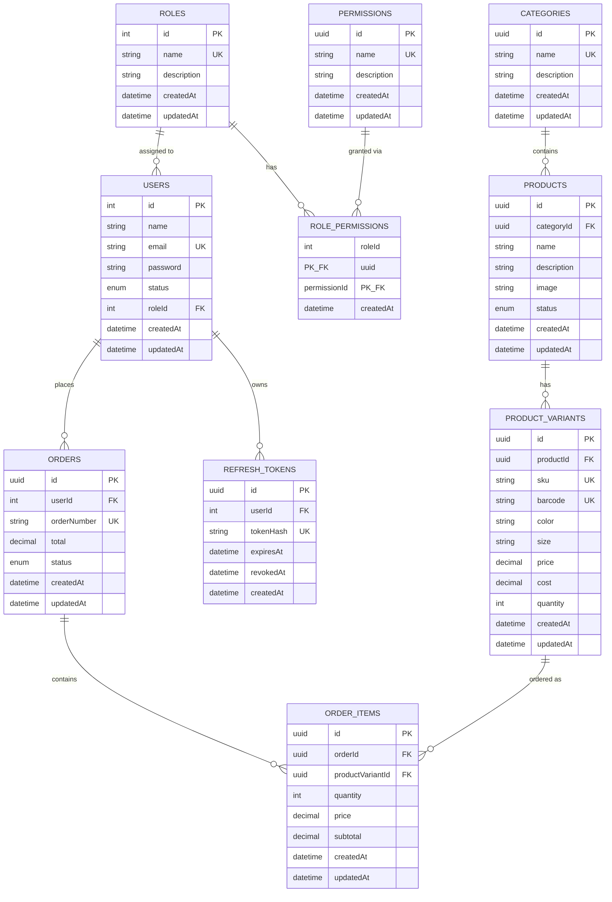

# Database Design

A realistic e-commerce schema covering **Users, Roles, Permissions, Categories, Products, Product Variants, Orders, Order Items,** and **Refresh Tokens** — sized to practice core NestJS concepts (relationships, DTOs, auth, RBAC, pagination, transactions) without enterprise-level overhead.

## Entity Relationship Diagram

**Relationship chain:** `Role → User → Order → Order Item ← Product Variant ← Product ← Category`

---

## 1. Users

Stores the people who can log into the system.

| Field | Type | Constraints | Description |
|---|---|---|---|
| id | Int | PK, autoincrement | Primary key |
| name | String | required | User's full name |
| email | String | unique | Login email |
| password | String | required | Hashed password |
| status | UserStatus | default: `ACTIVE` | `ACTIVE` or `INACTIVE` |
| roleId | Int? | FK → Roles, nullable | Assigned role |
| createdAt | DateTime | default: now | Created timestamp |
| updatedAt | DateTime | auto-updated | Updated timestamp |

**Indexes:** `roleId`

---

## 2. Roles

Named permission groups that can be assigned to users (RBAC).

| Field | Type | Constraints | Description |
|---|---|---|---|
| id | Int | PK, autoincrement | Primary key |
| name | String | unique | Role name (e.g. `admin`, `staff`) |
| description | String? | nullable | Optional description |
| createdAt | DateTime | default: now | Created timestamp |
| updatedAt | DateTime | auto-updated | Updated timestamp |

---

## 3. Permissions

Granular action flags that can be attached to roles.

| Field | Type | Constraints | Description |
|---|---|---|---|
| id | UUID | PK | Primary key |
| name | String | unique | Permission name (e.g. `products:create`) |
| description | String? | nullable | Optional description |
| createdAt | DateTime | default: now | Created timestamp |
| updatedAt | DateTime | auto-updated | Updated timestamp |

---

## 4. Role Permissions

Join table linking roles to their granted permissions.

| Field | Type | Constraints | Description |
|---|---|---|---|
| roleId | Int | PK, FK → Roles (cascade delete) | Role reference |
| permissionId | UUID | PK, FK → Permissions (cascade delete) | Permission reference |
| createdAt | DateTime | default: now | Granted timestamp |

**Composite PK:** `(roleId, permissionId)`  
**Indexes:** `permissionId`

---

## 5. Categories

Groups products together (e.g. Electronics, Fashion, Accessories).

| Field | Type | Constraints | Description |
|---|---|---|---|
| id | UUID | PK | Primary key |
| name | String | unique | Category name |
| description | String? | nullable | Optional description |
| createdAt | DateTime | default: now | Created timestamp |
| updatedAt | DateTime | auto-updated | Updated timestamp |

---

## 6. Products

Represents the product itself, not individual stock (e.g. "iPhone 16 Pro").

| Field | Type | Constraints | Description |
|---|---|---|---|
| id | UUID | PK | Primary key |
| categoryId | UUID | FK → Categories | Parent category |
| name | String | required | Product name |
| description | String? | nullable | Product description |
| image | String? | nullable | Main image URL |
| status | ProductStatus | default: `ACTIVE` | `ACTIVE` or `INACTIVE` |
| createdAt | DateTime | default: now | Created timestamp |
| updatedAt | DateTime | auto-updated | Updated timestamp |

**Indexes:** `categoryId`

---

## 7. Product Variants

Represents sellable variations of a product (e.g. iPhone 16 Pro / Black / 128GB vs. iPhone 16 Pro / White / 256GB).

| Field | Type | Constraints | Description |
|---|---|---|---|
| id | UUID | PK | Primary key |
| productId | UUID | FK → Products | Parent product |
| sku | String | unique | Stock Keeping Unit |
| barcode | String? | unique, nullable | Barcode |
| color | String? | nullable | Product color |
| size | String? | nullable | Size |
| price | Decimal(12,2) | required | Selling price |
| cost | Decimal(12,2) | required | Purchase cost |
| quantity | Int | default: 0 | Current stock quantity |
| createdAt | DateTime | default: now | Created timestamp |
| updatedAt | DateTime | auto-updated | Updated timestamp |

**Indexes:** `productId`

> For v1, `quantity` lives directly on the variant. As the app grows, move stock management into a dedicated inventory module with movement tracking.

---

## 8. Orders

Represents a customer's order.

| Field | Type | Constraints | Description |
|---|---|---|---|
| id | UUID | PK | Primary key |
| userId | Int | FK → Users | Order owner |
| orderNumber | String | unique | Human-readable order number |
| total | Decimal(12,2) | required | Total order amount |
| status | OrderStatus | default: `PENDING` | `PENDING`, `PAID`, `SHIPPED`, `COMPLETED`, `CANCELLED` |
| createdAt | DateTime | default: now | Created timestamp |
| updatedAt | DateTime | auto-updated | Updated timestamp |

**Indexes:** `userId`

---

## 9. Order Items

Stores the line items included in an order.

| Field | Type | Constraints | Description |
|---|---|---|---|
| id | UUID | PK | Primary key |
| orderId | UUID | FK → Orders | Parent order |
| productVariantId | UUID | FK → Product Variants | Variant purchased |
| quantity | Int | required | Quantity ordered |
| price | Decimal(12,2) | required | Price at time of purchase |
| subtotal | Decimal(12,2) | required | `price × quantity` |
| createdAt | DateTime | default: now | Created timestamp |
| updatedAt | DateTime | auto-updated | Updated timestamp |

**Indexes:** `orderId`, `productVariantId`

> `price` is snapshotted at order time — if a variant's price changes later, historical orders still reflect what the customer actually paid.

---

## 10. Refresh Tokens

Stores hashed refresh tokens for JWT rotation and revocation.

| Field | Type | Constraints | Description |
|---|---|---|---|
| id | UUID | PK | Primary key |
| userId | Int | FK → Users | Token owner |
| tokenHash | String | unique | Hashed refresh token |
| expiresAt | DateTime | required | Expiry timestamp |
| revokedAt | DateTime? | nullable | Set when token is revoked |
| createdAt | DateTime | default: now | Created timestamp |

**Indexes:** `userId`

---

## Enums

| Enum | Values |
|---|---|
| UserStatus | `ACTIVE`, `INACTIVE` |
| ProductStatus | `ACTIVE`, `INACTIVE` |
| OrderStatus | `PENDING`, `PAID`, `SHIPPED`, `COMPLETED`, `CANCELLED` |

---

## Future Expansion

Once comfortable with the current schema, these can be added without redesigning existing tables:

- Suppliers
- Purchase Orders
- Warehouses
- Inventory Movements
- Payments
- Coupons
- Reviews
- Addresses
- Wishlists
- Audit Logs

---

## Why This Scope Works for Learning NestJS

This schema covers:

- **One-to-Many relationships:** Category → Products, Product → Variants, Order → Order Items, User → Orders
- **Many-to-Many via join table:** Role ↔ Permission through `RolePermission`
- **RBAC:** Role-based access control with granular permissions per role
- **JWT auth with refresh tokens:** Secure token rotation and revocation
- **CRUD operations** across all resource types
- **Validation with DTOs** and class-validator
- **Pagination and filtering** on list endpoints
- **Transaction handling** (e.g. creating an order + decrementing variant stock atomically)
- **Decimal precision** (`Decimal(12,2)`) for monetary values
